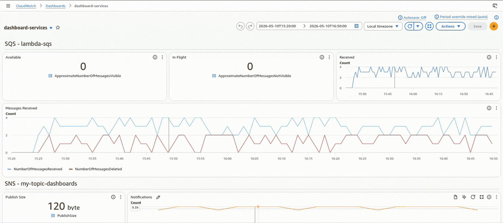
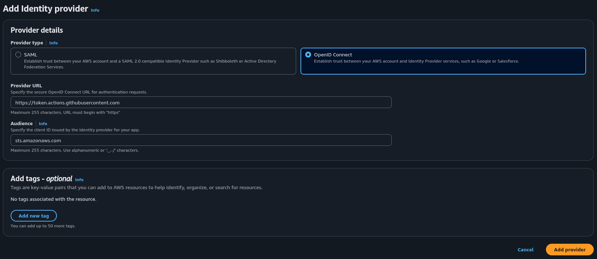
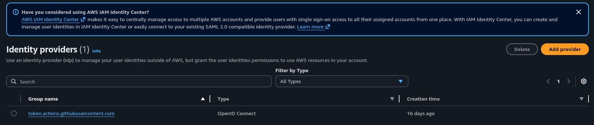
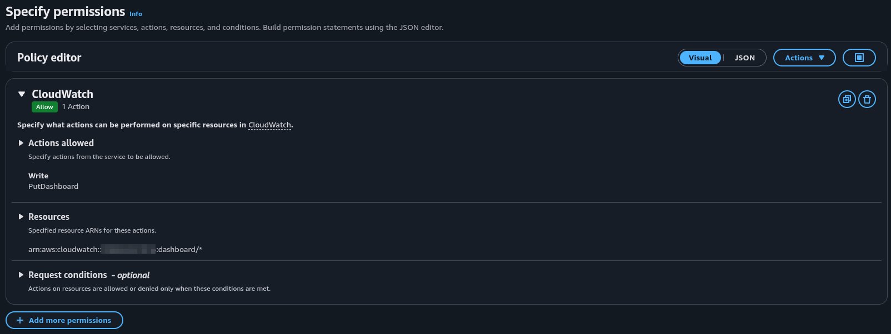
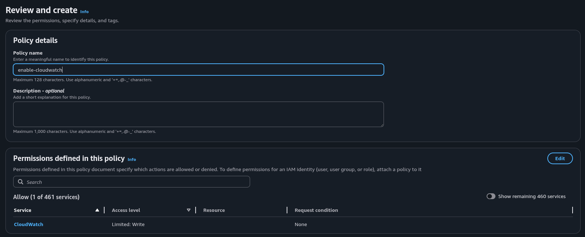
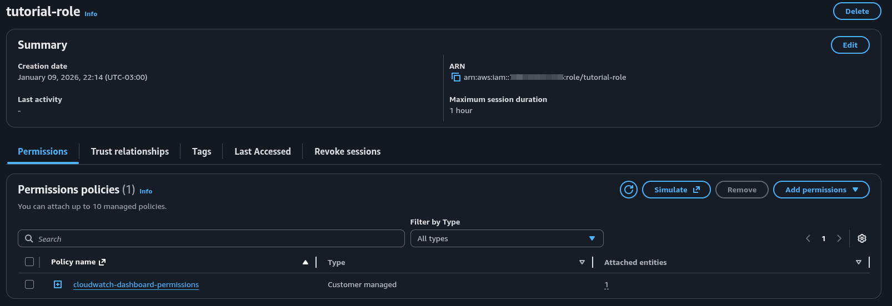

# Automate AWS CloudWatch dashboards with Github Actions



This action will automate the creation dashboards of the most popular AWS services.

This action helps you automate the creation dashboards in AWS cloud watch.
Getting started is easy, you need to open a github issue and select the services you want to create the dashboards.  

## The services below are available to create new dashboards

- S3
- SQS
- SNS
- Lambda
- Dynamodb

**This repository is frequently updated, also in the future new features will be added to the action in the future**

## Quick start

1. Navigate to your github workflow and include the action below

    ```yaml
      name: Connect to an AWS role from a GitHub repository

      on:
        issues:
          types: [opened]

      env:
        AWS_REGION: "REGION_NAME"

      permissions:
        id-token: write
        contents: read

      jobs:
        AssumeRoleAndCallIdentity:
          runs-on: ubuntu-latest
          steps:
            - name: configure aws credentials
              uses: aws-actions/configure-aws-credentials@v1.7.0
              with:
                role-to-assume: ROLE_NAME
                role-session-name: GitHub_to_AWS_via_FederatedOIDC
                aws-region: ${{ env.AWS_REGION }}
            - name: create dash
              uses: "JonasBarros1998/automate-dashboards@1.5.8"
    ```

2. Navigate to github repository and create a new issue. The title of the issue must be "Create Dashboard" and you need to add this JSON template below into the description field.  

    ```json
      {
        "title": "ADD_DASHBOARD_TITLE",
        "region": "us-east-1",
        "services": [
          {
            "enable": true,
            "serviceName": "ADD_YOUR_SERVICE_NAME",
            "serviceType": "ADD_YOUR_SERVICE_TYPE"
          }
        ]
      }
    ```

3. For example, use the template below if you need to create a dashboard for S3 and SQS services with the title dashboard-services.

    ```json
      {
        "title": "dashboard-services",
        "region": "us-east-1",
        "services": [
          {
            "enable": true,
            "serviceName": "my-bucket-s3",
            "serviceType": "S3"
          },
          {
            "enable": true,
            "serviceName": "my-sqs-queue",
            "serviceType": "SQS"
          }
        ]
      }
    ```
  
4. Click the **create** button to create the issue and trigger your GitHub workflow.

## Configuring your AWS account to allow the action creating the new dashboards

To use this action, you must create an IAM role and IAM policy. Follow the steps below to create these resources in your AWS account.  

**Prerequisites:**

1. In your project you must use github actions.
2. Your user must have permissions to create an **OpenID Connect IDP**, **policies**, and **roles** in your AWS account

### Creating an OIDC Provider in your AWS Account

1. Open the IAM Console

2. In the left navigation pane, select **Identity providers**

3. Click the **Add Provider** button located on the right of side your screen

4. In the **Provider Details** section, you must choose **OpenID Connect**

5. Enter ```https://token.actions.githubusercontent.com``` in the **Provider URL** field
  
6. Enter ```sts.amazonaws.com``` in the **Audience** field

7. Click the **Add Provider** button

8. The image below shows the completed OIDC Provider
    

9. After clicking the **Add Provider** button you will be redirected to the **Identity providers** list and your provider is ready to use.
   

10. Navigate to your provider and copy the ARN. We will use the ARN in step **12. Creating an IAM Role**. Your ARN should looks like the example below

    **Example**: arn:aws:iam::000000000000:oidc-provider/token.actions.githubusercontent.com

11. Create an IAM Policy

    1. Open the IAM Console

    2. In the left navigation pane, select **Policies**

    3. Clik the **Create policy** button

    4. In the **Select a service** section, select the CloudWatch service

    5. Filter and select permission **PutDashboard**. This permission will enable the action to create a new CloudWatch dashboard in AWS account.

    6. In the **Resources** section, click the **Add ARNs** button. A modal will open; Select the **Any dashboard name** checkbox. Click the **Add ARNs** button to close the modal.

    7. Once you have finished these steps, click the **Next** button

    8. In the section **Review and Create**, input the name and a description the policy. After clicking the **create policy** button.

    9. The images below, show the complete AWS Policy

      
      

12. Creating and attachment the policy in AWS IAM Role

    1. Navigate to the IAM Console

    2. In the left navigation pane, select **Identity providers** and click on the provider ```token.actions.githubusercontent.com```

    3. Click the **Assign role** button and select the **Create a new role** checkbox and then click **Next**

    4. In the **Trusted entity type** section, select the **Web identity** checkbox

    5. In the **Web identity** section, select ```sts.asmazonaws.com``` in the **Audience** field

    6. Enter your github organization name or username in the **Github organization** field

    7. Enter your repository name in the **Github repository** field. And then click **Next**

    8. In the **Add permissions** section, search for and select the policy name you created earlier and click **Next**

    9. Enter a name in the **role name** field. Choose a name that allows for easy identification

    10. *(Optional)* Enter a description in the **description** field. Explain why you created this role

    11. Once you have completed all steps, click the **create role** button

    12. Copy the **ARN** of the IAM role you just created

    13. The image below, shows a successfully completed AWS role
      

    14. Click the "Trust relationships" tab. The content should look like the example below:

      ```json
        {
          "Version": "2012-10-17",
          "Statement": [
            {
              "Effect": "Allow",
              "Principal": {
                "Federated": "arn:aws:iam::700552527916:oidc-provider/token.actions.githubusercontent.com"
              },
              "Action": "sts:AssumeRoleWithWebIdentity",
              "Condition": {
                "StringEquals": {
                  "token.actions.githubusercontent.com:aud": "sts.amazonaws.com"
                },
                  "StringLike": {
                    "token.actions.githubusercontent.com:sub": [
                        "repo:JonasBarros1998/emotional_analisys:*",
                        "repo:JonasBarros1998/emotional_analisys:*"
                      ]
                  }
              }
            }
          ]
        }
      ```

13. Navigate to github action and import the Role ARN. Your action should look like the example below

    ```yaml
    - name: configure aws credentials
        uses: aws-actions/configure-aws-credentials@v1.7.0
        with:
          role-to-assume: arn:aws:iam::700552527916:role/to_enable_creating_dashbaords
          role-session-name: GitHub_to_AWS_via_FederatedOIDC
          aws-region: ${{ env.AWS_REGION }}
    ```
